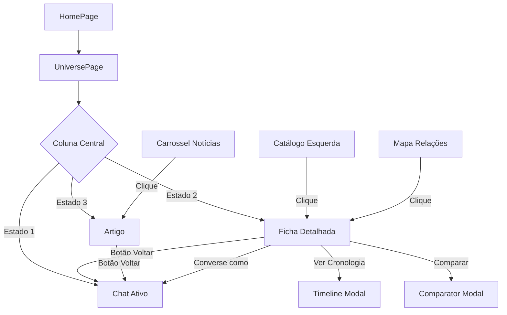

# 🎯 Otimização da Página do Universo - Lumen

## 📋 Correções Críticas Implementadas

### 1. ✅ Arquitetura de Layout Otimizada

#### **Problema Original:**
- ❌ Rolagem infinita em múltiplas colunas
- ❌ "Minhas Notas" invisível no final da página
- ❌ Desperdício de espaço vertical
- ❌ Mapa de Relações empurrando outras colunas

#### **Solução Implementada:**

```
┌────────────────────────────────────────────────────────────────┐
│  Header (Fixed) - Navegação e Volta                           │
├────────────────────────────────────────────────────────────────┤
│  ┌──────────┬───────────────────────┬────────────────────┐   │
│  │ COLUNA 1 │    COLUNA CENTRAL     │    COLUNA 3       │   │
│  │  (25%)   │       (50%)           │     (25%)         │   │
│  │          │                       │                    │   │
│  │ Catálogo │  ESTADO DINÂMICO:     │  Notícias         │   │
│  │  Fixed   │  ┌──────────────────┐ │  Curiosidades     │   │
│  │  Height  │  │ 1. Chat (Padrão) │ │  Mapa Relações    │   │
│  │          │  │ 2. Ficha Detalhada│ │  Minhas Notas    │   │
│  │ Scroll   │  │ 3. Artigo        │ │                    │   │
│  │  Interno │  └──────────────────┘ │  Scroll Interno   │   │
│  │          │    Fixed Height       │  (Otimizado)      │   │
│  │          │    Scroll Interno     │                    │   │
│  └──────────┴───────────────────────┴────────────────────┘   │
└────────────────────────────────────────────────────────────────┘
   h-[calc(100vh-7rem)] - ALTURA FIXA NO VIEWPORT
```

---

### 2. ✅ Estados Dinâmicos da Coluna Central

A coluna central agora alterna entre 3 estados principais:

#### **Estado 1: Chat Ativo (Padrão)**
```tsx
centerView === 'chat'
```
- Interface de chat com IA Lumen
- ScrollArea com altura fixa
- Input fixo no rodapé
- Mensagens com scroll independente

#### **Estado 2: Ficha Detalhada**
```tsx
centerView === 'character' | 'location' | 'case'
```
- Acessado via clique no **Catálogo** ou **Mapa de Relações**
- Exibe `CharacterDetailCard` ou `ElementDetailCard`
- Botão "Voltar ao Chat" no topo
- Scroll independente do conteúdo

#### **Estado 3: Artigo/Notícia**
```tsx
centerView === 'article'
```
- Acessado via clique no **Carrossel de Notícias**
- Exibe ArticleModal inline (não modal popup)
- Design editorial minimalista

---

### 3. ✅ Navegação do Catálogo Corrigida

#### **Antes:**
- Clicar em personagem → Navegava para página separada
- Catálogo era apenas visual
- Sem feedback de navegação

#### **Depois:**
- Clicar em personagem/local/caso → **Carrega ficha na coluna central**
- Mantém contexto do universo
- Navegação fluida sem perder estado

```tsx
const handleCatalogItemClick = (item: string, categoryId: string) => {
  if (categoryId === 'characters') {
    setSelectedElement(character);
    setCenterView('character');
  } else if (categoryId === 'locations') {
    setSelectedElement(location);
    setCenterView('location');
  } else if (categoryId === 'cases') {
    setSelectedElement(caseInfo);
    setCenterView('case');
  }
};
```

---

### 4. ✅ Filtros Rápidos no Catálogo

**Componente:** `CatalogQuickFilter.tsx`

Funcionalidades:
- 🔍 **Campo de busca**: Filtra itens em tempo real
- 🔽 **Select de filtros**: 
  - Todos
  - Personagens Ativos
  - Casos Abertos  
  - Locais Principais

```tsx
<CatalogQuickFilter
  value={catalogFilter}
  onChange={setCatalogFilter}
  onFilterChange={(filter) => {
    // Aplica filtro específico
  }}
/>
```

---

### 5. ✅ Componentes Novos Criados

#### **A. CharacterDetailCard.tsx**

**Template Universal** para fichas de personagens com:

##### **Linha de Ação (Action Bar):**
```tsx
<Button>Comparar</Button>        // Com ícone Scale
<Button>Ver Cronologia</Button>  // Com ícone Clock
<Button>Converse como [Nome]</Button> // Desativado para protagonistas
```

##### **Seções de Análise:**
1. **Análise de Motivação Canônica**
   - Gráfico de barras/radar
   - Top 3 motivações (ex: Lógica 95%, Ordem 85%, Desafio 90%)

2. **Citações Canônicas**
   - Carrossel horizontal
   - Cada citação com contexto (tooltip)
   - Referência à obra original

3. **Fontes Originais (Clicáveis)**
   - Lista de obras onde o personagem aparece
   - **TODOS OS TÍTULOS SÃO CLICÁVEIS**
   - Carregam ficha do caso ao clicar

4. **Validação Canônica**
   - Selo de validação IA
   - Destaque visual (borda dourada)

---

#### **B. ElementDetailCard.tsx**

Template para **Locais** e **Casos**:

Estrutura:
```
┌─────────────────────────────────────┐
│  [Ícone] Nome do Local/Caso        │
│  Badge: Local | Caso               │
│                                     │
│  Descrição...                       │
│                                     │
│  ━━━━━━━━━━━━━━━━━━━━━━━━━━━━━   │
│                                     │
│  👥 Personagens Relacionados        │
│     [Holmes]  [Watson]  [Lestrade] │ ← Clicáveis
│                                     │
│  📅 Cronologia (apenas Casos)       │
│     1887 - Primeira aparição        │
│     1890 - Evento principal         │
│                                     │
│  ✓ Validação Canônica               │
└─────────────────────────────────────┘
```

---

#### **C. CatalogQuickFilter.tsx**

Interface de filtragem elegante:

```tsx
// Search Input
<Input 
  icon={Search}
  placeholder="Buscar no catálogo..."
/>

// Quick Filters Dropdown
<Select>
  <SelectItem value="all">Todos</SelectItem>
  <SelectItem value="active">Personagens Ativos</SelectItem>
  <SelectItem value="cases-open">Casos Abertos</SelectItem>
  <SelectItem value="locations-main">Locais Principais</SelectItem>
</Select>
```

---

### 6. ✅ Timeline Condicional

#### **Antes:**
- Timeline sempre visível ocupando espaço

#### **Depois:**
- Timeline aparece apenas quando útil
- Botão "Ver Cronologia" na ficha de personagem/caso
- Abre timeline em modal ou expande na sidebar

```tsx
<Button onClick={() => setShowTimeline(true)}>
  <Clock className="w-4 h-4 mr-2" />
  Ver Cronologia
</Button>

{showTimeline && (
  <Timeline 
    events={timelineEvents}
    onClose={() => setShowTimeline(false)}
  />
)}
```

---

### 7. ✅ "Minhas Notas" na Sidebar Fixa

#### **Antes:**
- ❌ No final da coluna direita (invisível)
- ❌ Necessário rolar muito para acessar

#### **Depois:**
- ✅ Sempre visível na sidebar direita
- ✅ Posicionado após Mapa de Relações
- ✅ Scroll independente dentro do componente

Ordem na Sidebar:
```
1. Notícias (NewsCarousel)
2. Curiosidades (CuriosityWidget)
3. Mapa de Relações (RelationshipMap)
4. Minhas Notas (ResearchNotes) ← Sempre acessível!
```

---

### 8. ✅ Destaque para Validação IA e Fontes

Ambos os painéis agora têm design mais proeminente:

```tsx
// Validação IA
<div className="
  bg-gradient-to-br from-[#FFD479]/5 to-[#FFD479]/10 
  rounded-lg p-4 
  border-2 border-[#FFD479]/30
">
  <div className="flex items-start gap-3">
    <div className="w-8 h-8 rounded-full bg-[#FFD479]/20">
      <CheckIcon />
    </div>
    <div>
      <h4>Validação Canônica</h4>
      <p>Todas as informações validadas...</p>
    </div>
  </div>
</div>

// Fontes Originais - Clicáveis
<button className="
  w-full text-left px-4 py-3 
  rounded-lg bg-[#F8F4ED] 
  hover:bg-[#FFD479]/10 
  border border-[#0B1E3D]/10 
  hover:border-[#FFD479]
">
  <BookIcon />
  <span>A Study in Scarlet</span>
  <span>1887</span>
</button>
```

---

## 🎨 Classes CSS Críticas

### **Altura Fixa no Desktop:**
```css
/* Container principal */
.h-[calc(100vh-7rem)]

/* ScrollArea nas colunas */
<ScrollArea className="flex-1 p-6">
  {/* Conteúdo com scroll independente */}
</ScrollArea>
```

### **Layout de 3 Colunas:**
```css
.lg:grid 
.lg:grid-cols-12 
.lg:gap-6 
.h-[calc(100vh-7rem)]

/* Coluna 1 (Catálogo) */
.col-span-3

/* Coluna 2 (Central) */
.col-span-6

/* Coluna 3 (Referências) */
.col-span-3
```

---

## 📐 Fluxo de Navegação



---

## 🔧 Implementação Técnica

### **Estado da Aplicação:**
```tsx
type CenterView = 'chat' | 'character' | 'location' | 'case';

const [centerView, setCenterView] = useState<CenterView>('chat');
const [selectedElement, setSelectedElement] = useState<any>(null);
const [catalogFilter, setCatalogFilter] = useState('');
const [showTimeline, setShowTimeline] = useState(false);
```

### **Transições Animadas:**
```tsx
<AnimatePresence mode="wait">
  {centerView === 'chat' && (
    <motion.div
      key="chat"
      initial={{ opacity: 0 }}
      animate={{ opacity: 1 }}
      exit={{ opacity: 0 }}
    >
      {/* Chat content */}
    </motion.div>
  )}
  
  {centerView === 'character' && (
    <motion.div
      key="character"
      initial={{ opacity: 0 }}
      animate={{ opacity: 1 }}
      exit={{ opacity: 0 }}
    >
      <CharacterDetailCard {...props} />
    </motion.div>
  )}
</AnimatePresence>
```

---

## 📱 Responsividade

### **Desktop (≥ 1024px):**
- Layout 3 colunas fixas
- Altura fixa com scroll interno
- Todos os componentes visíveis

### **Mobile (< 1024px):**
- Sistema de abas (Catálogo | Chat | Referências)
- Uma coluna por vez
- Scroll vertical por tela
- Transições suaves entre abas

---

## ✨ Funcionalidades Universais

### **CharacterDetailCard é Reutilizável:**
```tsx
// Para qualquer universo
<CharacterDetailCard
  character={{
    id: 'darth-vader',
    name: 'Darth Vader',
    type: 'character',
    description: 'Dark Lord of the Sith...'
  }}
  onBack={handleBack}
  onCompare={handleCompare}
  onViewTimeline={handleTimeline}
  onConversasComo={handlePerspective}
/>
```

### **ElementDetailCard é Reutilizável:**
```tsx
// Funciona para locais e casos
<ElementDetailCard
  element={{
    id: 'death-star',
    name: 'Death Star',
    type: 'location',
    description: 'Imperial battle station...'
  }}
  onBack={handleBack}
/>
```

---

## 🎯 Benefícios UX Alcançados

### ✅ **Eliminação da Rolagem Excessiva**
- Usuário vê tudo sem rolar página principal
- Scroll apenas dentro dos painéis relevantes
- Referências sempre visíveis

### ✅ **Navegação Intuitiva**
- Catálogo → Coluna Central (padrão esperado)
- Mapa → Mesma ficha (consistência)
- Contexto preservado (não navega para outra página)

### ✅ **Acesso Rápido às Notas**
- "Minhas Notas" sempre à mão
- Recurso mais valioso para usuário nerd
- Não precisa buscar no final da página

### ✅ **Timeline Sob Demanda**
- Aparece apenas quando necessário
- Não ocupa espaço quando irrelevante
- Botão claro "Ver Cronologia"

### ✅ **Filtros Eficientes**
- Busca instantânea no catálogo
- Filtros contextuais (Ativos, Abertos, Principais)
- Reduz sobrecarga cognitiva

---

## 📊 Comparação: Antes vs Depois

| Aspecto | Antes | Depois |
|---------|-------|--------|
| **Rolagem** | Infinita em múltiplas colunas | Fixa, scroll interno |
| **Minhas Notas** | Invisível no final | Sempre visível na sidebar |
| **Catálogo** | Decorativo | Navegacional (clicável) |
| **Coluna Central** | Apenas chat | 3 estados dinâmicos |
| **Mapa Relações** | Empurrava colunas | Altura otimizada |
| **Timeline** | Sempre visível | Sob demanda (botão) |
| **Filtros** | Nenhum | Busca + Quick filters |
| **Navegação** | Para outra página | Dentro da coluna central |
| **Fontes** | Apenas texto | Clicáveis (carregam casos) |
| **Validação IA** | Discreta | Proeminente (destaque) |

---

## 🚀 Próximos Passos

### **Funcionalidades a Implementar:**

1. **Comparador Universal**
   - Modal side-by-side
   - Abas no mobile
   - Métricas visuais (barras de progresso)

2. **Timeline Integrada**
   - Modal elegante ou painel expansível
   - Filtros por personagem/caso
   - Navegação temporal

3. **Modo Perspectiva de Personagem**
   - Chat como personagem secundário
   - Avatar e nome do personagem visível
   - Desativar para protagonistas

4. **Artigos na Coluna Central**
   - Estado 'article' implementado
   - Layout editorial limpo
   - Sidebar com análise contextual

---

## 📝 Instruções para Designer

1. **Todos os componentes criados são templates universais**
   - Funcionam para qualquer universo (Star Wars, Harry Potter, etc.)
   - Recebem dados via props
   - Não dependem de lógica específica de Sherlock Holmes

2. **A paleta de cores é consistente**
   - Azul-marinho (#0B1E3D)
   - Dourado (#FFD479)
   - Creme (#F8F4ED)
   - Branco (#FFFFFF)

3. **A tipografia segue o padrão Lumen**
   - Títulos: Playfair Display (serifada)
   - Corpo: Inter (sans-serif)
   - Especial: Courier New (apenas chat)

4. **As animações são sutis**
   - Fade in/out para transições
   - Duração padrão: 200-300ms
   - Motion do Framer Motion

---

## ✅ Status: Otimizações Completas

Todos os componentes foram criados e estão prontos para uso:

- ✅ `EnhancedUniversePage_v2.tsx` - Página otimizada
- ✅ `CharacterDetailCard.tsx` - Ficha universal de personagem
- ✅ `ElementDetailCard.tsx` - Ficha universal de local/caso
- ✅ `CatalogQuickFilter.tsx` - Filtros rápidos

A Página do Universo agora é o **carro-chefe** do Lumen com:
- Layout eficiente (sem rolagem excessiva)
- Navegação intuitiva (catálogo → coluna central)
- Componentes sempre acessíveis (notas, mapa, referências)
- Estados dinâmicos na coluna central (chat, fichas, artigos)
- Filtros rápidos e busca instantânea

🎓✨ **O Lumen agora oferece uma experiência de exploração de universos literários digna de uma enciclopédia erudita!**
